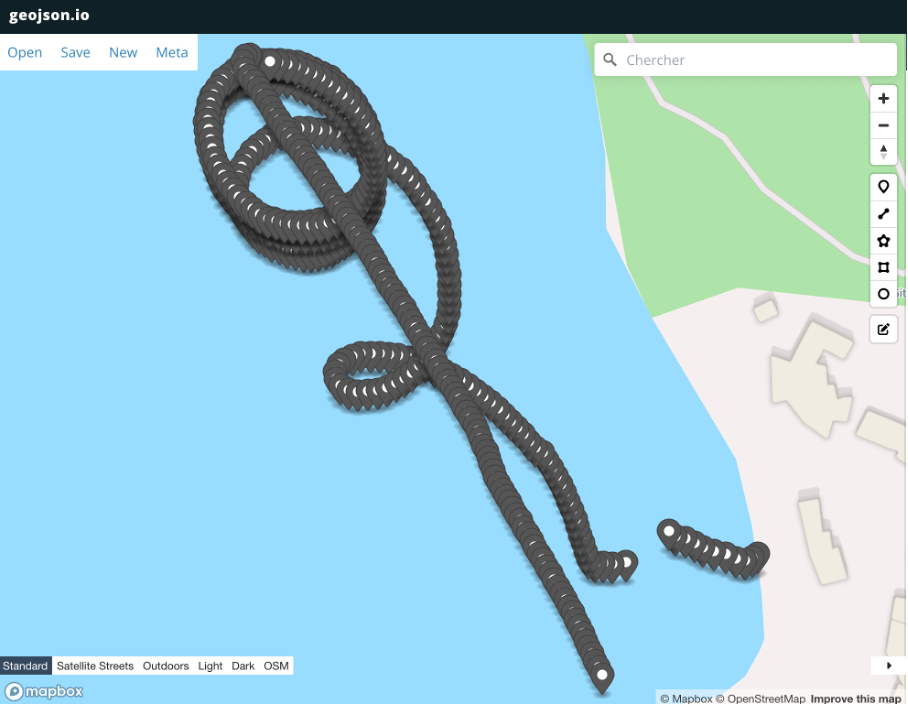
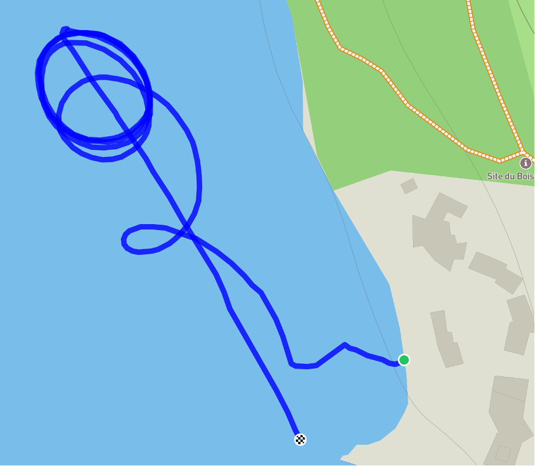
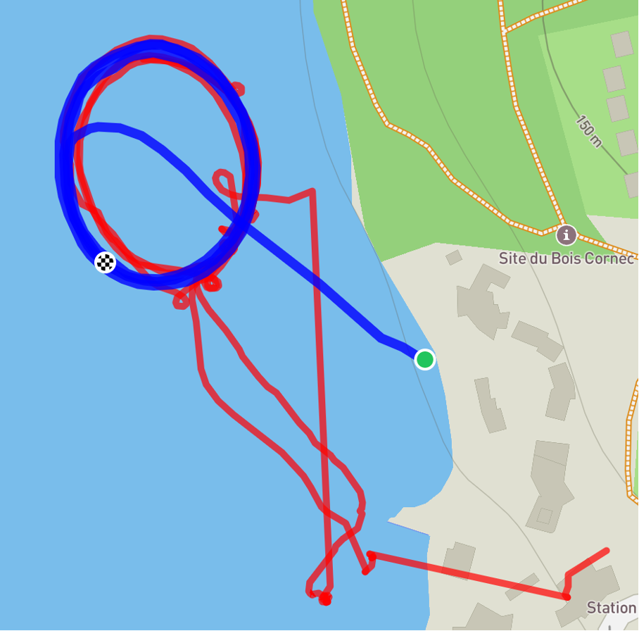
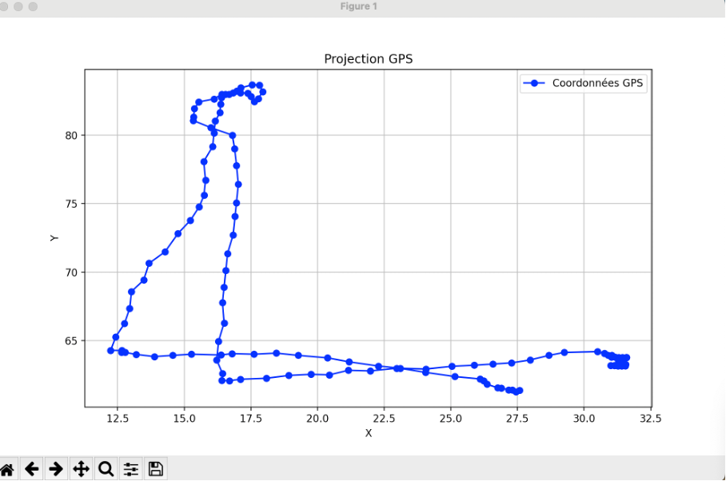

# Notes #

Les données GPS sont automatiquement sauvegardées à la suite d'un fichier .txt avec `mesure_gps()`, il faut donc penser à le supprimer avant de vouloir faire une mesure propre.

## grp16 ##
Ce dossier est prêt à être envoyé sur n'importe quel bateau à condition d'avoir son fichier calib_xx.txt, le fichier à executer est `consensus.py`.

## **quoicouroblib.py**
### `depart()`
Attend qu'une accélération supérieure à 8 m/s² soit détectée sur l'axe x pour déclencher un départ.
- **Input**: Aucun
- **Output**: Aucun

---

### `attendre_exact_heure(heure, minute)`
Attend jusqu'à atteindre une heure précise (heure et minute) et affiche un compte à rebours.
- **Input**:
  - `heure` (int): Heure souhaitée
  - `minute` (int): Minute souhaitée
- **Output**: 
  - `True` lorsque l'heure est atteinte

---

### `sawtooth(x)`
Permet de limiter la valeur de x entre -pi et pi.
- **Input**: 
  - `x` (float)
- **Output**: 
  - `x` (float)

---

### `mag()`
Récupère les données du magnétomètre et les corrige à l'aide de matrices de calibration.
- **Input**: Aucun
- **Output**: 
  - `y` (np.array) - Champ magnétique corrigé [x, y, z]

---

### `accel()`:
Calcule la valeur corrigée de l'accélération brute en utilisant les matrices de correction.
- **Input**: Aucun
- **Output**: `y` (np.array) - Accélération corrigée [x, y, z]

---

### `gyro()`:
Lit les données brutes du gyroscope.

- **Input**: Aucune
- **Output**: Retourne un tableau NumPy contenant les valeurs brutes du gyroscope dans les directions x, y et z.

---

### `angles_euler(acc, mag)`:
Calcule les angles d'Euler (Tangage, Roulis, Cap) à partir des données d'accélération et de magnétomètre.
- **Input**:
  - `acc` (np.array): Vecteur d'accélération corrigé [x, y, z]
  - `mag` (np.array): Vecteur de champ magnétique corrigé [x, y, z]
- **Output**:
  - `angles` (np.array): Angles d'Euler [Tangage, Roulis, Cap]

---

### `rotuv(u, v)`:
Retourne la rotation avec l'angle minimal tel que \( v = R \cdot u \).
- **Input**: 
  - `u` : Vecteur 3D d'entrée
  - `v` : Vecteur 3D cible
- **Output**: Matrice de rotation \( R \in \mathbb{R}^{3 \times 3} \)

---

### `scalarprod(u,v)`:
Fait un produit scalaire entre u et v
- **Input**: 
  - `u` : Vecteur 3D
  - `v` : Vecteur 3D
- **Output**: Scalaire

---

### `adjoint(w)`:
Retourne l'Adjoint de w
- **Input**: 
  - `w`: Scalaire ou matrice 
- **Output**:
  - retourne une matrice (2,2) ou (3,3)

---

### `angles_euler_2(a1, y1, w1, g1_hat)`:
Calcule les angles d'Euler (tangage, roulis, cap) à partir des données d'accélération, de magnétomètre et de gyroscope.
- **Input**: 
  - `a1` : Vecteur accélération
  - `y1` : Vecteur magnétomètre
  - `w1` : Vecteur gyroscope
  - `g1_hat` : Estimation précédente de \( g_1 \)
- **Output**: Angles d'Euler \( \varphi \) (tangage), \( \theta \) (roulis), et \( \psi \) (cap)

---

### `dd_to_dms(dd, direction)`:
Convertit les coordonnées en degrés décimaux (DD) vers le format degrés, minutes, secondes (DMS).
- **Input**:
  - `dd` (float): Coordonnée en degrés décimaux
  - `direction` (str): Direction ('N', 'S', 'E', 'W') pour appliquer le signe correct
- **Output**: 
  - `dms` (str) - Coordonnée au format degrés, minutes, secondes (DMS)

---

### `dm_to_dd(dm, direction)`:
Convertit les coordonnées en degrés-minutes (DM) vers le format degrés décimaux (DD).
- **Input**:
  - `dm` (float): Coordonnée en degrés-minutes
  - `direction` (str): Direction ('N', 'S', 'E', 'W') pour appliquer le signe correct
- **Output**: 
  - `dd` (float) - Coordonnée en degrés décimaux (DD)

---

### `dms_to_dd(dms, direction)`:
Convertit les coordonnées au format degrés, minutes, secondes (DMS) vers le format degrés décimaux (DD).
- **Input**:
  - `dms` (str): Coordonnée au format degrés, minutes, secondes (DMS) sous forme de chaîne
  - `direction` (str): Direction ('N', 'S', 'E', 'W') pour appliquer le signe correct
- **Output**: 
  - `dd` (float) - Coordonnée en degrés décimaux (DD)

---

### `mesure_gps(fichier="/mesures/gps_data.txt")`:
Récupère les données GPS (GLL) et les écrit dans un fichier.
- **Input**:
  - `fichier` (str): Chemin du fichier où les données GPS doivent être enregistrées
- **Output**: 
  - `gll_data` (tuple) - Données GPS sous forme de tuple

---

### `gps_dd()`:
Récupère les données GPS en degrés décimaux
- **Input**:
  - None
- **Output**: 
  - `lat`,`long` (float)

---

### `create_csv(input_file, output_csv_path)`:
Convertit un fichier de données GPS (.txt) en un fichier CSV avec latitude et longitude.
- **Input**:
  - `input_file` (str): Chemin du fichier .txt contenant les données GPS
  - `output_csv_path` (str): Chemin du fichier CSV de sortie
- **Output**: Aucun

---

### `afficher_data(csv_file, output_geojson_file)`:
Crée un fichier GeoJSON à partir des données GPS contenues dans un fichier CSV.
- **Input**:
  - `csv_file` (str): Chemin du fichier CSV contenant les données GPS
  - `output_geojson_file` (str): Chemin du fichier GeoJSON de sortie
- **Output**: Aucun

---

### `projection(lat, long, lat_m=48.199170, long_m=-3.014700)`:
Convertit les coordonnées GPS (latitude, longitude) en coordonnées cartésiennes locales par rapport à un point de référence.
- **Input**:
  - `lat` (float): Latitude en degrés décimaux
  - `long` (float): Longitude en degrés décimaux
  - `lat_m` (float): Latitude du point de référence en degrés décimaux (optionnel)
  - `long_m` (float): Longitude du point de référence en degrés décimaux (optionnel)
- **Output**: 
  - `p` (np.array) - Coordonnées cartésiennes relatives [x, y]

---

### `cap_waypoint(a, p)`:
Calcule le cap à suivre pour atteindre un waypoint depuis un point de départ.
- **Input**:
  - `a` (np.array): Coordonnée du point de départ [latitude, longitude]
  - `p` (np.array): Coordonnée du waypoint [latitude, longitude]
- **Output**: 
  - `cap` (float) - Cap à suivre en radians

### `arret_waypoint(a, p, distance_min=2)`:
Vérifie si la distance entre le point actuel et le waypoint est inférieure à une distance minimale spécifiée, pour déclencher l'arrêt.

- **Input**:
  - `a` (np.array): Coordonnées actuelles [x, y]
  - `p` (np.array): Coordonnées du waypoint [x, y]
  - `distance_min` (float): Distance minimale pour considérer l'arrêt (par défaut 2)

- **Output**: 
  - `True` si la distance est inférieure à `distance_min`, sinon `False`

---

### `regulation_vitesse(distance, vmax=200, vmin=45, coef=1, middle=4)`:
Régule la vitesse en fonction de la distance à un point de référence. La vitesse est calculée à l'aide d'une fonction sigmoïde pour assurer une transition fluide.

- **Input**:
  - `distance` (float): Distance actuelle à un point de référence
  - `vmax` (int): Vitesse maximale (par défaut 200)
  - `vmin` (int): Vitesse minimale (par défaut 45)
  - `coef` (float): Coefficient de régulation (par défaut 1)
  - `middle` (float): Distance centrale pour la régulation (par défaut 4)

- **Output**:
  - `vitesse` (float): Vitesse régulée entre `vmin` et `vmax`

---

### `reach_point()`
Rejoindre un point GPS donné par le point A en format degrés décimaux.

- **Input**: 
  - `lat_a` (float): Latitude du point A.
  - `long_a` (float): Longitude du point A.
  - `debug` (bool, optionnel): Affiche les messages de débogage si `True`. Par défaut `True`.

- **Output**: `None`

---

### `cap_waypoint_2()`
Calcule le cap pour suivre une droite définie par un point A et un vecteur directeur n, depuis un point P.

- **Input**: 
  - `m` (np.array): Point A.
  - `n` (np.array): Vecteur directeur de la droite.
  - `p` (np.array): Point P.
  - `debug` (bool, optionnel): Affiche les messages de débogage si `True`. Par défaut `False`.

- **Output**: 
  - `cap_d` (float): Cap calculé en radians.

---

### `suivre_droite()`
Permet de suivre une droite définie par un point M et un point A, exprimés en format degrés décimaux.

- **Input**: 
  - `M` (list): Coordonnées GPS du point de départ `[lat, long]`.
  - `A` (list): Coordonnées GPS du point d’arrivée `[lat, long]`.
  - `debug` (bool, optionnel): Affiche les messages de débogage si `True`. Par défaut `True`.

- **Output**: `None`

---

### `distance_droite()`
Calcule la distance entre un point P et une droite définie par un point A et un vecteur normal n.

- **Input**: 
  - `a` (np.array): Point A sur la droite.
  - `n` (np.array): Vecteur normal à la droite.
  - `p` (np.array): Point P.

- **Output**: 
  - `distance` (float): Distance entre le point P et la droite. La distance est positive si P est à gauche de la droite dans le sens du vecteur n.

---

### `maintien_cap(acc, mag, cap, spd_base, debug=False)`:
Maintient le cap en ajustant la vitesse des moteurs gauche et droite pour compenser l'erreur angulaire.
- **Input**:
  - `acc` (np.array): Vecteur d'accélération corrigé [x, y, z]
  - `mag` (np.array): Vecteur de champ magnétique corrigé [x, y, z]
  - `cap` (float): Cap désiré en radians
  - `spd_base` (int): Vitesse de base des moteurs
  - `debug` (bool): Affichage des informations de débogage (facultatif)
- **Output**: Aucun

---

### `maintien_cap_2(acc, mag, cap, spd_base, debug=False)`:
Cette fonction fonctionne moins bien que la suivante: `maintien_cap` provenant du premier Guerlédan. Nous avons alors décidé de ne pas nous servir de cette seconde fonction par la suite.  

---

### `cercle()`:
Calcule les consignes de vitesse et de cap pour faire évoluer un bateau sur une trajectoire définie.    
Notre bateau suit une cible dont la position est `p_tilde`. La cible suit ici une trajectoire circulaire.  
- **Input**:  
  - `n`: Indice du bateau  
  - `t`: Temps  
  - `lat_boue`, `long_boue`: Position cible  
  - `k1`, `k2`: Coefficients de régulation  
  - `r`: Rayon de la trajectoire circulaire  
  - `T`: Période  
  - `debug`: Affiche des informations supplémentaires si activé  
- **Output**:  
  - `speed`: Vitesse du bateau  
  - `cap_d`: Cap désiré  
  - `p_tilde`: Position cible intermédiaire  
  - `p`: Position actuelle  

---

### `suivre_vecteur()`:
Cette fonction fait suivre au bateau un vecteur de direction calculé par `cercle()` grâce à la fonction `maintien_cap` durant une durée définie, ici 3min.
- **Input**:  
  - `n`: Indice du bateau  
  - `t0`: Temps initial  
  - `lat_m`, `long_m`: Position cible  
  - `boucle`: Exécution continue (`True`) ou unique (`False`)  
- **Output**:  
  - `p_tilde`: Position cible intermédiaire  
  - `p`: Position actuelle  

---

### `robot2_client_onetime()`:
Connecte le client au serveur pour recevoir une position GPS unique et la convertir en latitude et longitude.  
- **Input**:  
  - `server_ip`: Adresse IP du serveur  
- **Output**:  
  - `lat`: Latitude en degrés décimaux  
  - `long`: Longitude en degrés décimaux  

---

### `calc_b_A_from_file()`:
Calcule le biais magnétique `b` et la matrice de calibration `A` à partir des données d’un fichier `.txt`.  
- **Input**:  
  - `filename`: Nom du fichier `.txt` contenant les données de mesure  
- **Output**:  
  - `b`: Vecteur de biais 3x1  
  - `A`: Matrice de calibration 3x3  

## `calibration.py`:
Permet de faire une calibration de l'accéléromètre et de la boussole et on enregistre les coefs A et b en format .npy.

Les mesures pour la calibration de la boussole sont enregistrées dans calib_16.txt.

## `geojson.py`:
Permet à partir du fichier `gps_data.txt` de récupérer un fichier .geojson.

Exemple:

## `gpx.py`:
Permet à partir du fichier `gps_data.txt` de récupérer un fichier .gpx (fait une trace gps avec un trait et non des points).

Exemple:

## `jour_1.py`:
Le but de la première journée était de faire suivre un cap à notre bateau.  
Nous avons donc créé ce code permet de suivre un cap Ouest pendant 30s puis ensuite de suivre le cap Nord à nouveau pendant 30s.  
Ce code utilise et teste les fonctions `maintien_cap` et `maintien_cap_2` évoquées ultérieurement.  

## `jour_2_matin.py`:
La mission du jour 2 était de tourner autour d'une bouée.
Nous avons alors créé ce code qui utilise la fonction `suivre_vecteur` évoquées ultérieurement afin de réaliser des cercles autour de la bouée dont nous avions les coordonnées.  

## `jour3.py`:
On a `mission_jour_3`, qui consiste à réaliser des cercles autour d'un bateau. Dans cette partie le bateau cible était immobile. Cette mission nous a permis de prendre en main la communication entre les bateaux. En effet le bateau cible émettait sa position ce qui nous permettait de la recevoir.  
Nous avons également `mission2_jour_3`, qui consiste à cette fois ci suivre un bateau cible en mouvement via la fonction `maintien_cap`.

## `consensus.py`:
Permet de lancer la mission du jour 2 sur n'importe quel bateau.

Exemple:

## `stop.py`:
Arrete le bateau

## `test_cap.py`:
Permet de tester la correction de cap de la fonction `maintien_cap`

## `test_gps.py`:
Permet de tester le gps et les conversions de coordonnées.

## `test_heure.py`:
Test de la fonction `attendre_exact_heure()`

## `test_mesures.py`:
Test les mesures de l'accéléromètre et de la boussole. On peut vérifier la calibration avec ce code

## `test_projection.py`:
Permet de tester la projection et enregistre un fichier `points_projection.csv`. Ce fichier peut être tracé avec `tracer_csv.py` pour vérifier l'orientation de nos axes. Notre axe x était orienté vers le Sud.

Exemple: Déplacement vers le nord puis vers l’est (petit tour sur 1m), déplacment vers l’ouest puis vers le sud.

## `test_regulation_vitesse.py`:
Ce fichier nous permet de rapidement choisir la régulation en vitesse de notre bateau et de la tester en affichant la tanh.

## Critique de notre semaine:

Nous sommes globalement très satisfaits de notre travail réalisé lors de cette semaine à Guerledan. En effet, lors de notre toute première semaine en début d'année, nous avions eu énormément de problèmes. Nous avions eu du mal à réaliser les missions au jour le jour. Ainsi du retard s'était accumulé et c'était assez difficile à gérer bien que finalement nous ayons pu réaliser à peu près toutes les missions en travaillant notamment beaucoup le soir.  
Cette semaine ci fut complétement différente. En effet, nous avons mieux su nous organiser et mieux nous répartir les tâches ce qui a conduit à une semaine presque parfaite. Cela vient peut-être également de notre maîtrise de git qui s'est fortement consolidée cette semaine mais qui était nulle en septembre. Nous avons réussi toutes les missions le jour même. Ainsi, nous avons eu le temps de nous reposer, de faire du sport, etc. De plus, le lendemain nous étions prêts à réaliser de nouvelles missions et non à essayer de finir celles de la veille...  
Notre seule déception est le dernier jour. En effet, la mission était alors de réaliser une performance avec tous les bateaux en même temps. Nous avions pu la veille réaliser une performance qui consistait à réaliser des cercles autour d'un point fixe avec plusieurs bateaux en même temps, grâce à `consensus.py`, depuis l'ordinateur de Mr. Zerr. Cela a très bien marché. Nous aurions pu nous contenter de cela pour le lendemain mais nous avons été un peu plus, peut-être même trop ambitieux. 
En effet, nous avons eu l'idée de faire rejoindre un même point à tous les bateaux, puis de faire un cercle autour de ce point. Il fallait ensuite répéter l'opération autour d'un autre point pour finalement que tous les bateaux reviennent au ponton.  
Cependant, nous avons modifié beaucoup de nos fonctions pour réaliser cela, notamment car la veille les bateaux ne s'arrêtaient jamais de tourner, ce qui n'était pas possible ici.  
Ce n'était pas de gros changements à faire mais nous n'avons pas pu retester notre code avant la démonstration et elle a malheureusement échoué, nous ne savons pas vraiment pourquoi.  
  
Comme nous l'avons déjà dit précédemment, nous sommes tout de même très satisfaits de notre travail. Nous avons en soi réaliser notre démonstration la veille donc nous sommes tout de même fiers. Malgré tout, nous retenons que le fait de tenter un code pour la première fois comme nous l'avons fait ici en démonstration n'est pas vraiment une bonne idée ...  